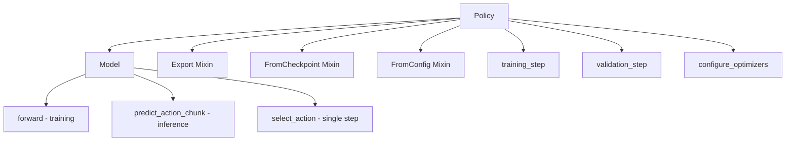

# Policy Design

Policies are Lightning modules that wrap PyTorch models for training and inference.

## Structure

Each policy follows a consistent structure:

```text
policy_name/
├── config.py   # Dataclass configuration
├── model.py    # PyTorch nn.Module
└── policy.py   # Lightning module wrapper
```

## Architecture



## Base Class

All policies inherit from `Policy`, which provides:

- **Action queue management** - For action chunking (predicting multiple future actions)
- **Gym evaluation** - Built-in rollout evaluation with torchmetrics
- **Device transfer** - Automatic batch-to-device handling for `Observation` objects

```python
class Policy(L.LightningModule, ABC):
    def __init__(self, n_action_steps: int = 1) -> None:
        self._action_queue: deque[Tensor] = deque(maxlen=n_action_steps)
        self.val_rollout = Rollout()
        self.test_rollout = Rollout()

    @abstractmethod
    def forward(self, batch: Observation) -> Any: ...

    @abstractmethod
    def predict_action_chunk(self, batch: Observation) -> Tensor: ...

    def select_action(self, batch: Observation) -> Tensor:
        """Returns single action, using queue for chunked predictions."""
```

## PolicyLike Protocol

For inference flexibility, a `PolicyLike` protocol defines the minimal interface:

```python
@runtime_checkable
class PolicyLike(Protocol):
    def select_action(self, observation: Observation) -> Tensor: ...
    def reset(self) -> None: ...
```

Both `Policy` and `InferenceModel` satisfy this protocol, enabling:

- Training with full Lightning infrastructure
- Production inference with exported models
- Unified benchmarking interface

## Implemented Policies

| Policy        | Description                  | Source                |
| ------------- | ---------------------------- | --------------------- |
| **ACT**       | Action Chunking Transformer  | Native implementation |
| **Diffusion** | Diffusion Policy             | LeRobot wrapper       |
| **GROOT**     | Vision-language policy       | Native implementation |
| **Pi0**       | Physical Intelligence model  | Native implementation |
| **SmolVLA**   | Small Vision-Language-Action | Native + LeRobot      |

## Creating a New Policy

The config → model → policy workflow:

1. **Config contains all parameters** (`config.py`):

   ```python
   @dataclass
   class MyConfig(Config):
       # Model architecture params
       hidden_dim: int = 256
       chunk_size: int = 100
       # I/O structure
       input_features: dict[str, Feature] = field(default_factory=dict)
       output_features: dict[str, Feature] = field(default_factory=dict)
   ```

2. **Model has explicit constructor args** (`model.py`):

   ```python
   class MyModel(nn.Module, FromConfig):
       def __init__(
           self,
           input_features: dict[str, Feature],
           output_features: dict[str, Feature],
           *,
           hidden_dim: int = 256,
           chunk_size: int = 100,
       ):
           super().__init__()
           self.config = MyConfig(
               hidden_dim=hidden_dim,
               chunk_size=chunk_size,
               input_features=input_features,
               output_features=output_features,
           )
           # ... build network using params

       def forward(self, batch: dict) -> tuple[Tensor, dict]:
           """Training: returns (loss, loss_dict)"""

       def predict_action_chunk(self, batch: dict) -> Tensor:
           """Inference: returns action chunk [B, T, D]"""
   ```

   **FromConfig mixin enables**: `MyModel.from_config(config)` creates model from config object

3. **Policy also has explicit args** (`policy.py`):

   ```python
   class MyPolicy(FromConfig, FromCheckpoint, Export, Policy):
       model_type = MyModel
       model_config_type = MyConfig

       def __init__(self, model: MyModel | None = None, optimizer_fn=None):
           super().__init__(n_action_steps=model.config.chunk_size if model else 1)
           self.model = model

       # ... Lightning methods (training_step, configure_optimizers, etc.)
   ```

   **FromConfig mixin enables**: `MyPolicy.from_config(config)` creates policy directly from config
   **FromCheckpoint mixin enables**: `MyPolicy.load_from_checkpoint(path)` reconstructs policy from saved checkpoint

   ```python
   # Example implementation
   class MyPolicy(FromConfig, FromCheckpoint, Export, Policy):
       model_type = MyModel
       model_config_type = MyConfig

       def __init__(self, model: MyModel | None = None, optimizer_fn=None):
           super().__init__(n_action_steps=model.config.chunk_size if model else 1)
           self.model = model
           self.optimizer_fn = optimizer_fn

       def forward(self, batch: Observation):
           if self.training:
               return self.model(batch.to_dict())
           return self.predict_action_chunk(batch)

       def predict_action_chunk(self, batch: Observation) -> Tensor:
           return self.model.predict_action_chunk(batch.to(self.device).to_dict())

       def training_step(self, batch, batch_idx):
           loss, _ = self.model(batch.to_dict())
           self.log("train/loss", loss)
           return {"loss": loss}

       def configure_optimizers(self):
           if self.optimizer_fn:
               return self.optimizer_fn(self.model.parameters())
           return torch.optim.Adam(self.model.parameters(), lr=1e-4)
   ```

### Instantiation Patterns

```python
# Pattern 1: Policy from config (recommended)
config = MyConfig(
    hidden_dim=512,
    chunk_size=100,
    input_features=dataset.observation_features,
    output_features=dataset.action_features,
)
policy = MyPolicy.from_config(config)  # FromConfig mixin

# Pattern 2: Load from checkpoint (inference)
policy = MyPolicy.load_from_checkpoint("checkpoint.ckpt")  # FromCheckpoint mixin

# Pattern 3: Direct instantiation (advanced users)
model = MyModel(
    input_features=dataset.observation_features,
    output_features=dataset.action_features,
    hidden_dim=512,
    chunk_size=100,
)
policy = MyPolicy(model=model)
```

## Mixins

Policies compose functionality through mixins:

| Mixin            | Purpose                                                  |
| ---------------- | -------------------------------------------------------- |
| `FromConfig`     | Adds `from_config()` for creating policy from config     |
| `FromCheckpoint` | Adds `load_from_checkpoint()` with config reconstruction |
| `Export`         | Adds `export()`, `to_onnx()`, `to_openvino()` methods    |

## See Also

- [Base Policy](base.md) - Detailed base class documentation
- [Export Design](../export/overview.md) - Model export system
- [Data Module](../data/overview.md) - Dataset integration
