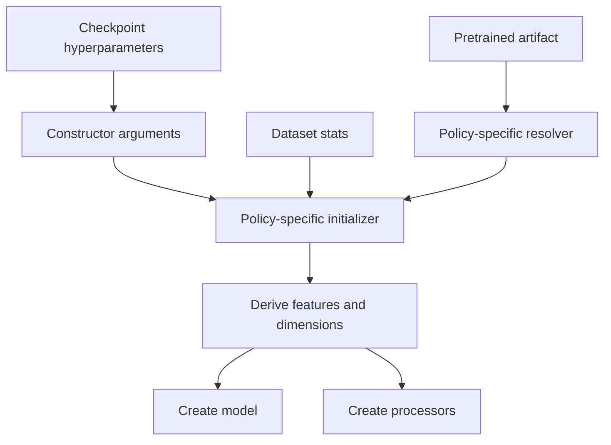
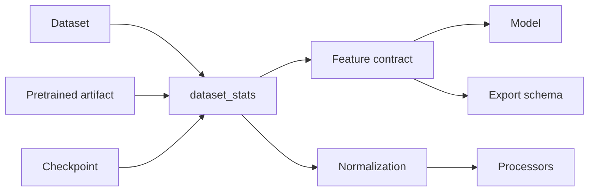
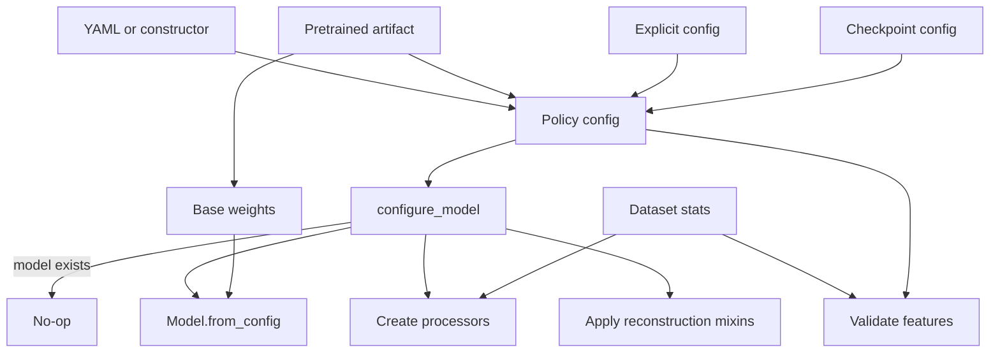
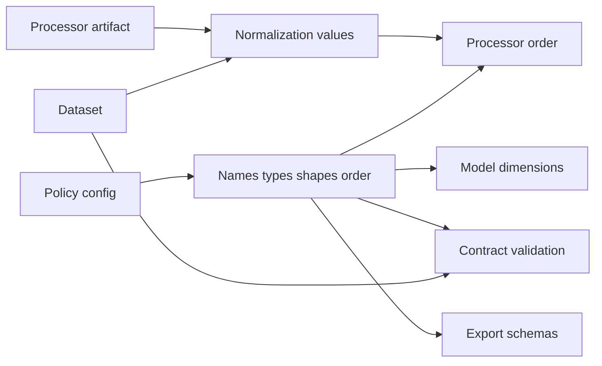
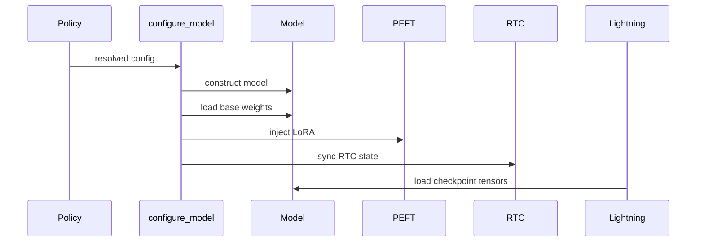
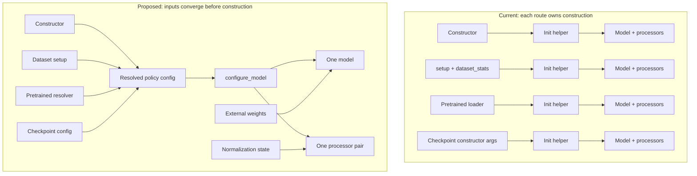

# Current and Proposed Policies

Current policies use several construction patterns. The new design keeps several
inputs but uses one model creation method: `configure_model()`.

- **Input route**: constructor, config, dataset, pretrained artifact, or checkpoint.
- **Materialization**: creating the model and processors.

## Summary

| Concern | Current | Proposed |
| --- | --- | --- |
| Model creation | Policy-specific helpers | One guarded `configure_model()` |
| Features | Often rebuilt from `dataset_stats` | Ordered features in the policy config |
| Normalization | Mixed with feature metadata | Dataset or processor state |
| Pretrained loading | Policy-specific handling | Resolve config and weights, then build once |
| Checkpoints | Constructor args and often `dataset_stats` | Saved config builds the model before tensor loading |
| Capabilities | Policy-specific code | Shared PEFT and RTC mixins |

## Current Design

ACT, Groot, Pi0, Pi05, SmolVLA, RLDX1, and LeRobot do not share one construction
contract.



`dataset_stats` often contains both feature metadata and normalization values. This
makes statistics part of model construction.

### Current Routes

**Lazy training**

```text
Policy(...)
    -> setup("fit") reads dataset.stats
    -> policy-specific initializer
    -> model and processors
```

This is common in ACT, Groot, Pi0, Pi05, SmolVLA, and RLDX1.

**Eager construction**

```text
Policy(dataset_stats=...)
    -> policy-specific initializer
    -> model and processors
```

ACT, Pi0, Pi05, SmolVLA, and RLDX1 support this pattern. Groot also needs an action
dimension. LeRobot can use explicit features or a LeRobot config.

**Pretrained construction**

```text
Pretrained path
    -> resolve config, stats, and weights
    -> policy-specific initializer
    -> load weights and create processors
```

Each policy returns a different artifact bundle. RLDX1 also resolves shards and camera
names.

**Checkpoint restoration**

```text
Checkpoint
    -> restore constructor arguments and dataset_stats
    -> create model
    -> load state_dict
```

LeRobot uses a custom loader.

**Explicit config**

Support varies. LeRobot accepts feature dictionaries. RLDX1 merges feature overrides
into `dataset_stats`. Other policies mainly use large constructors.

### Current Initializers

| Policy | Helper |
| --- | --- |
| ACT | `_initialize_model(dataset_stats, weights_file)` |
| Groot | `_initialize_model(env_action_dim, dataset_stats)` |
| Pi0 | `_initialize_model(dataset_stats)` |
| Pi05 | `_initialize_model(dataset_stats, weight_file)` |
| SmolVLA | `_initialize_model(dataset_stats, weights_file)` |
| RLDX1 | `_initialize_model(dataset_stats, shard_files)` |
| LeRobot | `_initialize_policy(input_features, output_features, config, dataset_stats)` |

## Current Feature Ownership



| Policy | Feature source | Normalization source |
| --- | --- | --- |
| ACT | `dataset_stats` | Model and feature state |
| Groot | Dataset metadata and stats | `dataset_stats` |
| Pi0 | `dataset_stats` | `dataset_stats` |
| Pi05 | Config plus `dataset_stats` | Processor and export state |
| SmolVLA | Config plus `dataset_stats` | Processor and export state |
| RLDX1 | Features merged into `dataset_stats` | Merged stats |
| LeRobot | Explicit or LeRobot features | Separate stats passed to processors |

## Why Problems Occur

Current routes make the same decisions in different places. Each route may resolve
features, dimensions, processors, weights, and capabilities differently.

| Cause | Possible result |
| --- | --- |
| Constructor and `setup()` can both create the model | The model is built twice or guarded differently per policy |
| Pretrained and checkpoint paths use separate loaders | One route applies weights or capabilities in a different order |
| Features are rebuilt from `dataset_stats` | Missing stats can block model creation even when architecture is known |
| Stats contain features and normalization | New normalization values can appear to change model structure |
| Export reads `dataset_stats` again | Training and export can use different names, shapes, or order |
| Checkpoints save constructor inputs instead of one resolved config | Restore can depend on old defaults or the original artifact |
| LoRA is injected after checkpoint loading | Adapter keys do not match the checkpoint state dictionary |
| Action chunks are trimmed inside the model | RTC loses future actions needed for blending |

These bugs are route-dependent. A policy may work in training but fail when loaded
from a checkpoint or exported.

## Proposed Design

The policy config owns model structure and ordered features. `configure_model()` is the
only materialization method.



```python
def configure_model(self) -> None:
    if self.model is not None:
        return

    config = self._config or self._resolve_config()
    self._config = config
    self.model = MyModel.from_config(config)
    self._preprocessor, self._postprocessor = make_policy_processors(config)
```

The guard prevents duplicate construction and repeated capability injection.

### Proposed Routes

| Route | Config source | Normalization | Weights |
| --- | --- | --- | --- |
| YAML or constructor | Explicit policy inputs | Dataset or processor artifact | Fresh or selected artifact |
| Explicit config | Caller | Dataset or processor state | Fresh |
| Pretrained | Artifact config | Artifact or dataset | Artifact weights |
| Checkpoint | Saved config | Saved processor state or dataset | Checkpoint state dictionary |
| Training | Existing config validated against dataset | Dataset | Fresh or loaded |

All routes call `configure_model()`.

- Constructors may call it when all inputs are present.
- `setup("fit")` validates or adopts dataset features.
- Pretrained resolvers return config and weight paths only.
- Checkpoints restore config before Lightning loads tensors.
- Checkpoint loading never fetches the original artifact.

## Proposed Feature Ownership



The config defines features. Dataset or processor state defines normalization. No route
parses `dataset_stats` to rebuild feature identity.

The executable prototype still supports lazy dataset feature adoption and stores
normalization on `Feature`. These are temporary migration aids.

## Mixins



- PEFT changes state-dict keys. Save its settings in the config. Inject adapters before
  checkpoint tensor loading.
- RTC is runtime state. Sync it after model creation. Apply it before chunk trimming.

## Before and After



### What Changes

| Current | Proposed |
| --- | --- |
| Each route can create a model | Routes only resolve inputs |
| Each route may infer features | One config owns the feature contract |
| Stats drive structure and normalization | Config drives structure; processor state drives normalization |
| Weight order varies by loader | `configure_model()` fixes the order |
| Checkpoint restore may replay pretrained loading | Checkpoint config rebuilds locally |
| Export can rediscover the contract | Export derives from the same config |

The new design does not remove input routes. It removes route-specific model creation.
This makes training, restore, inference, and export use the same resolved contract.

See [Policy Migration](migration.md) for migration steps.
