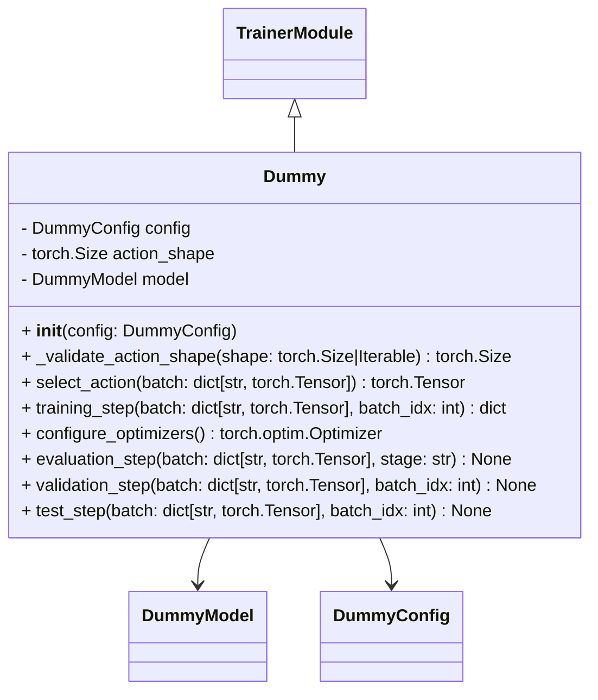
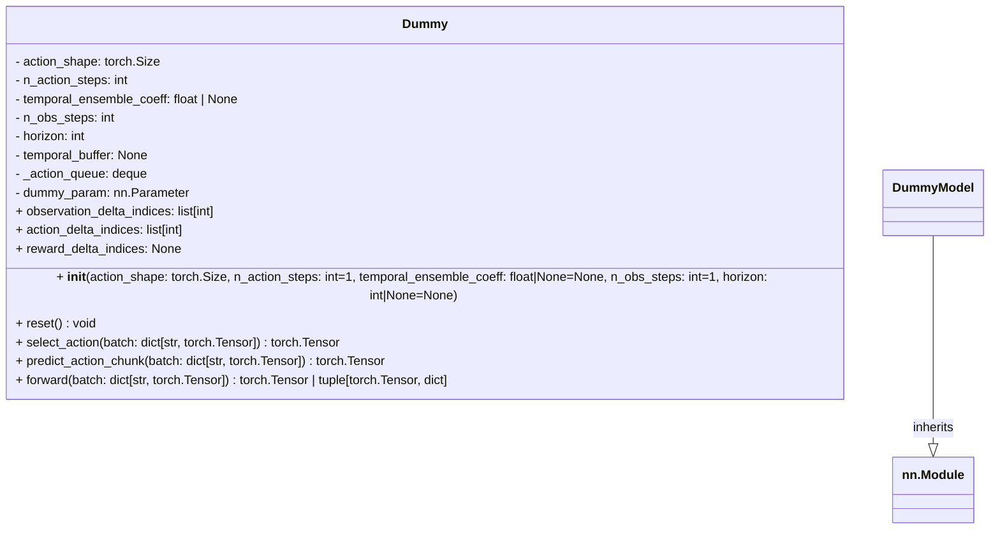

<!-- markdownlint-disable MD013 -->

# Dummy

## Dummy policy

A dummy policy here just takes in what shape the action it should output.

The idea is to use in integration with our `Trainer`.



## Dummy Model

Similarly a dummy model is to ensure we can expose the correct params,
for dataset interaction and also predict fake actions for use in a `Trainer`.



Example:

```python
from physicalai.data import LeRobotDataModule
from physicalai.policies import Dummy, DummyConfig

if __name__ == "__main__":
    l_dm = LeRobotDataModule(repo_id="lerobot/pusht")
    policy = Dummy(DummyConfig(action_shape=l_dm.train_dataset.action_features["action"]["shape"]))
```
