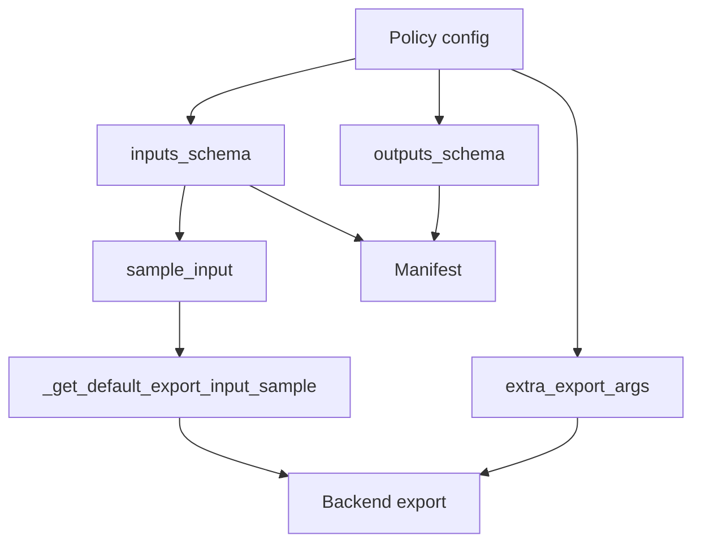

# Export API

Export is optional. `ExportablePolicyMixin` owns backend calls, tracing, conversion,
and manifests. Policy-specific export code belongs in a dedicated export mixin.

Export hooks remain properties. They may compute values, validate config, and raise
clear errors.

## Lifecycle



Schemas are for tracing and manifests. They do not control training.

## Properties

| Property | Purpose |
| --- | --- |
| `inputs_schema` | Raw runtime inputs in manifest order |
| `outputs_schema` | Exported outputs in manifest order |
| `sample_input` | Raw values used for tracing |
| `extra_export_args` | Stable backend and manifest settings |

Derive schemas from the resolved policy config. Do not use `dataset_stats` as a feature
registry.

Return `None` when config is unavailable or export is unsupported. Raise `ValueError`
when a resolved config violates the export contract.

`sample_input` may be derived from `inputs_schema`. Override it for values such as token
IDs, masks, or RTC controls.

`extra_export_args` may define output names, dynamic axes, preprocessing,
postprocessing, tokenizer behavior, and compression defaults. Keep one-off choices as
arguments to the export call.

`get_supported_export_backends()` lists only tested backends.

## Backend Methods

Policies normally inherit:

- `to_torch()`;
- `to_onnx()`;
- `to_openvino()`;
- `to_executorch()`.

Use public properties for normal customization. Do not override backend methods only
to change names or parameters.

## Sample Preparation

`_get_default_export_input_sample()`:

1. reads `sample_input`;
2. moves tensors to the policy device;
3. runs `_preprocessor`;
4. keeps tensors accepted by tracing.

It is private. Override it only in a dedicated export mixin and only when public hooks
are not enough.

## Example

```python
class MyPolicyExportMixin(ExportablePolicyMixin):
    @property
    def inputs_schema(self) -> list[InferenceFeature] | None:
        return None if self._config is None else build_input_schema(self._config)

    @property
    def outputs_schema(self) -> list[InferenceFeature] | None:
        return None if self._config is None else build_output_schema(self._config)

    @property
    def extra_export_args(self) -> dict[str, ExportParameters]:
        if self._config is None:
            return {}
        return build_backend_parameters(self._config, self.outputs_schema)

    @staticmethod
    def get_supported_export_backends() -> list[str | ExportBackend]:
        return [ExportBackend.TORCH, ExportBackend.ONNX, ExportBackend.OPENVINO]
```

## Errors

| State | Result |
| --- | --- |
| Config unavailable | Return `None` for schema or sample |
| Export unsupported | Return `None` and omit the backend |
| Resolved config invalid | Raise `ValueError` with the failed contract |
| Required sample missing | Backend raises `RuntimeError` |
| Backend parameters invalid | Raise with backend context |

## Override Rules

Do not override in the core policy:

- backend methods for routine parameter changes;
- manifest creation for simple names;
- `_get_default_export_input_sample()` when `sample_input` is enough;
- export hooks to affect training or model construction.

Put required exceptions in the export mixin. Add focused tests.

## Related Pages

- [Export system overview](../export/README.md)
- [Policy Migration](migration.md)
- [Advanced Patterns](advanced.md)
