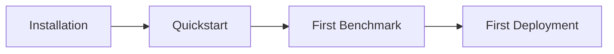

# Getting Started

Learn Geti Action through hands-on tutorials. Each guide builds on the previous one.

## Tutorials

| Tutorial                                | Time   | Description                           |
| --------------------------------------- | ------ | ------------------------------------- |
| [Installation](installation.md)         | 5 min  | Install the library and prerequisites |
| [Quickstart](quickstart.md)             | 5 min  | Train your first policy               |
| [First Benchmark](first-benchmark.md)   | 10 min | Evaluate your trained policy          |
| [First Deployment](first-deployment.md) | 10 min | Export and deploy to production       |

## Learning Path

## Prerequisites

- Python 3.10+
- Basic Python knowledge
- ~2GB disk space for demo datasets
- GPU recommended (CPU works but is slower)

## What You'll Build

By the end of these tutorials, you'll have:

1. ✅ A trained ACT policy on the ALOHA cube transfer task
2. ✅ Benchmark results showing your policy's performance
3. ✅ An exported model ready for deployment

## Next Steps

After completing the Getting Started tutorials:

- [How-To Guides](../how-to/) - Solve specific problems
- [Explanation](../explanation/) - Understand the architecture
