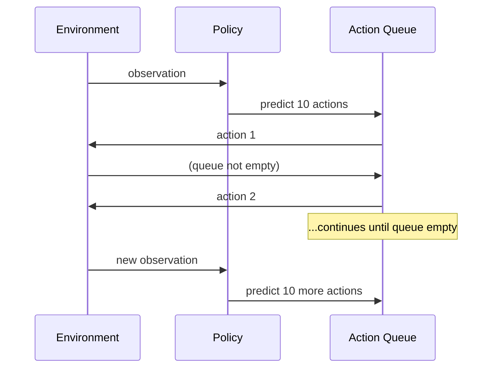

# First Deployment

Export your trained policy and run inference in production.

## What You'll Do

1. Export your checkpoint to an optimized format
2. Load the exported model for inference
3. Run a control loop

## Prerequisites

- [Trained policy checkpoint](quickstart.md)
- Export backend installed (OpenVINO, ONNX, or Torch)

## Step 1: Export Your Policy

### Choose a Backend

| Backend      | Best For                                   | Install                |
| ------------ | ------------------------------------------ | ---------------------- |
| **OpenVINO** | Intel CPUs, GPUs, NPUs                     | `pip install openvino` |
| **ONNX**     | NVIDIA GPUs (via TensorRT), cross-platform | `pip install onnx`     |
| **Torch**    | Edge devices, mobile                       | Built-in               |

### Export with Python

```python test="skip" reason="requires checkpoint"
from getiaction.policies import ACT

# Load checkpoint
policy = ACT.load_from_checkpoint(
    "experiments/lightning_logs/version_0/checkpoints/last.ckpt"
)

# Export to OpenVINO
policy.export("./policy_export", backend="openvino")
```

### Export with CLI

```bash
getiaction export \
    --model getiaction.policies.ACT \
    --ckpt_path experiments/lightning_logs/version_0/checkpoints/last.ckpt \
    --export_path ./policy_export \
    --backend openvino
```

### Exported Files

```text
policy_export/
├── model.xml          # OpenVINO model (or .onnx/.pt for other backends)
├── model.bin          # Model weights
├── metadata.yaml      # Policy configuration
└── metadata.json      # Same as YAML, for programmatic access
```

## Step 2: Load for Inference

```python test="skip" reason="requires exported model"
from getiaction.inference import InferenceModel

# Load exported model (auto-detects backend)
policy = InferenceModel.load("./policy_export")
```

The same code works regardless of which backend you exported to.

## Step 3: Run Inference Loop

### Basic Control Loop

```python test="skip" reason="requires exported model and environment"
from getiaction.inference import InferenceModel

# Load model
policy = InferenceModel.load("./policy_export")

# Initialize environment (your robot or simulation)
obs, info = env.reset()

# Reset policy (clears action queue)
policy.reset()

# Control loop
done = False
while not done:
    # Get action from policy
    action = policy.select_action(obs)

    # Execute action
    obs, reward, terminated, truncated, info = env.step(action)
    done = terminated or truncated
```

### With Error Handling

```python test="skip" reason="requires exported model and environment"
import logging
from getiaction.inference import InferenceModel

logging.basicConfig(level=logging.INFO)
logger = logging.getLogger(__name__)

policy = InferenceModel.load("./policy_export")

try:
    obs, info = env.reset()
    policy.reset()

    step = 0
    max_steps = 300

    while step < max_steps:
        action = policy.select_action(obs)
        obs, reward, terminated, truncated, info = env.step(action)

        step += 1

        if terminated:
            logger.info(f"Task completed at step {step}")
            break
        if truncated:
            logger.warning(f"Episode truncated at step {step}")
            break

except Exception as e:
    logger.error(f"Inference failed: {e}")
    raise
finally:
    env.close()
```

## Understanding Action Chunking

Policies like ACT predict multiple future actions at once ("action chunking"). The `InferenceModel` handles this automatically:



You don't need to manage this—just call `select_action()` every step.

## Performance Optimization

### Warm-up the Model

First inference is slower due to compilation:

```python test="skip" reason="requires exported model and environment"
policy = InferenceModel.load("./policy_export")

# Warm-up with dummy observation
dummy_obs = get_dummy_observation()  # Match your observation format
_ = policy.select_action(dummy_obs)

# Now inference is fast
policy.reset()
obs, _ = env.reset()
# ... run actual inference
```

### Measure Latency

```python test="skip" reason="requires exported model"
import time

policy = InferenceModel.load("./policy_export")
obs = get_observation()

# Warm-up
_ = policy.select_action(obs)
policy.reset()

# Benchmark
n_iterations = 100
start = time.time()
for _ in range(n_iterations):
    _ = policy.select_action(obs)
elapsed = time.time() - start

print(f"Latency: {elapsed / n_iterations * 1000:.2f} ms per action")
```

### Tips

1. **Match backend to hardware**: OpenVINO for Intel, ONNX + TensorRT for NVIDIA
2. **Reuse policy instance**: Don't reload the model every episode
3. **Keep policy on same device**: Avoid CPU↔GPU transfers during inference

## Real Robot Integration

For real robot deployment, your observation typically includes:

```python test="skip" reason="requires robot hardware"
# Example observation structure (varies by robot)
observation = {
    "image": camera_image,           # RGB image from camera
    "state": robot.get_joint_positions(),  # Current joint positions
}

action = policy.select_action(observation)

# Action is typically joint position targets
robot.move_to(action)
```

See your robot's documentation for specific observation and action formats.

## What's Next?

- [How-To Guides](../how-to/) for advanced deployment scenarios
- [Export Design](../explanation/design/export/overview.md) for backend details
- [Inference Design](../explanation/design/inference/overview.md) for architecture

## Troubleshooting

**"Backend not found"**: Install the required backend (`pip install openvino` or `pip install onnx`)

**Action shape mismatch**: Ensure your observation format matches training data

**Slow inference**: Try a different backend, or ensure you're using GPU if available

**Memory issues**: Export with a smaller batch size or use a lighter policy
