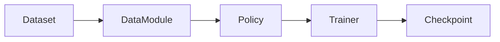

# Quickstart

Train your first policy in 5 minutes.

## What You'll Do

1. Download a demo dataset
2. Train an ACT policy
3. View training progress

## Prerequisites

- [Geti Action installed](installation.md)
- ~2GB disk space for demo dataset
- GPU recommended (CPU works but is slower)

## Step 1: Train with CLI (Easiest)

The fastest way to train a policy:

```bash
getiaction fit \
    --model getiaction.policies.ACT \
    --data getiaction.data.LeRobotDataModule \
    --data.repo_id lerobot/aloha_sim_transfer_cube_human \
    --trainer.max_epochs 10
```

This command:
- Downloads the `aloha_sim_transfer_cube_human` dataset from HuggingFace Hub
- Initializes an ACT (Action Chunking Transformer) policy
- Trains for 10 epochs

Training output appears in `experiments/lightning_logs/version_N/`.

## Step 2: Train with Python API

For more control, use the Python API:

```python test="skip" reason="requires dataset download"
from getiaction.data import LeRobotDataModule
from getiaction.policies import ACT
from getiaction.train import Trainer

# 1. Load dataset
datamodule = LeRobotDataModule(
    repo_id="lerobot/aloha_sim_transfer_cube_human",
    train_batch_size=32,
)

# 2. Create policy
policy = ACT()

# 3. Train
trainer = Trainer(max_epochs=10)
trainer.fit(model=policy, datamodule=datamodule)
```

## Step 3: Monitor Training

Training logs are saved to `experiments/lightning_logs/version_N/`:

```
experiments/lightning_logs/version_0/
├── checkpoints/
│   ├── last.ckpt          # Latest checkpoint
│   └── epoch=9-step=1000.ckpt
├── hparams.yaml           # Hyperparameters
└── events.out.tfevents... # TensorBoard logs
```

### View with TensorBoard

```bash
tensorboard --logdir experiments/lightning_logs
```

Open http://localhost:6006 in your browser.

## What's Happening?



1. **Dataset**: Demonstration recordings (images + robot joint positions + actions)
2. **DataModule**: Loads and batches data for training
3. **Policy**: Neural network that predicts actions from observations
4. **Trainer**: Manages training loop, checkpointing, logging
5. **Checkpoint**: Saved model weights you can deploy

## Training Tips

### Use a Config File

For reproducible experiments, use YAML configs:

```yaml
# configs/my_experiment.yaml
model:
  class_path: getiaction.policies.ACT

data:
  class_path: getiaction.data.LeRobotDataModule
  init_args:
    repo_id: lerobot/aloha_sim_transfer_cube_human
    train_batch_size: 32

trainer:
  max_epochs: 100
  accelerator: auto
  devices: 1
```

Run with:

```bash
getiaction fit --config configs/my_experiment.yaml
```

### Adjust Batch Size

If you run out of GPU memory:

```bash
getiaction fit \
    --config configs/my_experiment.yaml \
    --data.train_batch_size 8
```

### Quick Validation Run

Test your setup without a full training run:

```bash
getiaction fit \
    --config configs/my_experiment.yaml \
    --trainer.fast_dev_run true
```

This runs one batch through training and validation.

## Common Datasets

| Dataset | Robot | Task | Size |
|---------|-------|------|------|
| `lerobot/aloha_sim_transfer_cube_human` | ALOHA | Pick and place cube | ~2GB |
| `lerobot/pusht` | 2D pusher | Push T-block to target | ~500MB |
| `lerobot/aloha_sim_insertion_human` | ALOHA | Peg insertion | ~2GB |

Browse more at [huggingface.co/lerobot](https://huggingface.co/lerobot).

## Summary

You've trained your first policy! The checkpoint at `experiments/lightning_logs/version_N/checkpoints/last.ckpt` is ready to:

- [Evaluate on benchmarks](first-benchmark.md)
- [Export for deployment](first-deployment.md)

## Troubleshooting

**Out of memory**: Reduce `--data.train_batch_size`

**Slow download**: Dataset downloads are cached in `~/.cache/huggingface/`

**No GPU detected**: Check `torch.cuda.is_available()` returns `True`
