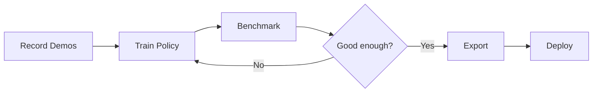

# Geti Action Library Documentation

Welcome to the Geti Action Library documentation. This library helps you train and deploy Vision-Language-Action (VLA) policies for robotic imitation learning.

## Quick Links

| I want to...             | Go to                                           |
| ------------------------ | ----------------------------------------------- |
| Get started quickly      | [Quickstart](getting-started/quickstart.md)     |
| Install the library      | [Installation](getting-started/installation.md) |
| Train my first policy    | [Getting Started](getting-started/)             |
| Solve a specific problem | [How-To Guides](how-to/)                        |
| Understand how it works  | [Explanation](explanation/)                     |

## Getting Started

New to Geti Action? Start here:

1. **[Installation](getting-started/installation.md)** - Install the library
2. **[Quickstart](getting-started/quickstart.md)** - Train your first policy in 5 minutes
3. **[First Benchmark](getting-started/first-benchmark.md)** - Evaluate your trained policy
4. **[First Deployment](getting-started/first-deployment.md)** - Export and deploy to production

## Documentation Structure

This documentation follows the [Diátaxis framework](https://diataxis.fr/):

```text
docs/
├── getting-started/    # Tutorials - learning-oriented
├── how-to/             # How-to guides - goal-oriented
└── explanation/        # Explanation - understanding-oriented
```

### [Getting Started](getting-started/)

**Learning-oriented tutorials** that take you through a series of steps to complete a project. Start here if you're new.

### [How-To Guides](how-to/)

**Goal-oriented guides** that show you how to solve specific problems. Use these when you know what you want to do.

### [Explanation](explanation/)

**Understanding-oriented** discussion of concepts and design decisions. Read this to understand why things work the way they do.

## Workflow Overview



## Supported Policies

| Policy       | Description                                                 | Paper                                                                          |
| ------------ | ----------------------------------------------------------- | ------------------------------------------------------------------------------ |
| **ACT**      | Action Chunking with Transformers                           | [Zhao et al. 2023](https://arxiv.org/abs/2304.13705)                           |
| **SmolVLA**  | Lightweight vision-language-action model                    | [Cadene et al. 2024](https://huggingface.co/lerobot/smolvla_base)              |
| **Pi0**      | Physical Intelligence foundation model                      | [Black et al. 2024](https://www.physicalintelligence.company/download/pi0.pdf) |
| **GR00T N1** | Vision-language grounded policy                             | [Bjork et al. 2025](https://arxiv.org/abs/2503.14734)                          |
| **Pi0.5**    | Vision-Language-Action Model with Open-World Generalization | [Black et al. 2025](https://arxiv.org/pdf/2504.16054)                          |

## Need Help?

- **Bug reports**: [GitHub Issues](https://github.com/open-edge-platform/geti-action/issues)
- **Questions**: [GitHub Discussions](https://github.com/open-edge-platform/geti-action/discussions)
- **Contributing**: [Contribution Guide](../../CONTRIBUTING.md)
