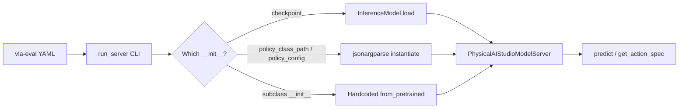

# Benchmark Proposal

## Motivation

To fairly and systematically evaluate the implementation of models we should provide some easy ways to benchmark.

There are several benchmarks on the market, [LIBERO](), [Robosuite](), [Meta-world](), [VLABench](), [MolmoSpaces]() and more being added all the time.

The pain point of testing our models on these benchmarks are:
    - Different API for each simulator
    - Package clashes, out of date python envs etc
    - Outdated OS requirements

For the above reasons the community has turned to using model / benchmark servers and using Docker to 

Top examples:
    - [allenai vla-eval](https://github.com/allenai/vla-evaluation-harness)
    - [robodojo](https://robodojo-benchmark.com/doc/)

We should provide examples / working benchmark code to show re-implementation has been sucessful and also in the future that compressed / quantized can still provide valuable insight.

A lot of these benchmarks also provide significant speedups, allenai boasts 47x speedup.


## Integration


### Overview

I believe we should support more than just one benchmark suite i.e we can support allenai/vla-eval and robodojo quite simply. Both of these packages require just a model server, from alllenai/vla-eval the integration is as simple as:

```python
class MyModelServer(PredictModelServer):
    def __init__(self, checkpoint: str, **kwargs: Any) -> None:
        super().__init__(**kwargs)
        self.checkpoint = checkpoint

        import torch
        # Load model here...
        self._model = ...

    def predict(self, obs: Observation, ctx: SessionContext) -> Action:
        """Single-observation inference. Blocking call.

        Args:
            obs: {"images": {"cam_name": np.ndarray HWC uint8},
                  "task_description": str,
                  "state": np.ndarray (optional)}
            ctx: Session context (session_id, episode_id, step, is_first)

        Returns:
            {"actions": np.ndarray} with shape:
              - (action_dim,) for single actions
              - (chunk_size, action_dim) for action chunks
        """
        # Extract image and task description
        images = obs.get("images", {})
        img_array = next(iter(images.values()))
        pil_image = PILImage.fromarray(img_array).convert("RGB")
        text = obs.get("task_description", "")
        # Run inference...
        actions = ...
        return {"actions": np.array(actions, dtype=np.float32)}

    def get_action_spec(self) -> dict[str, DimSpec]:
        # Declare the action format this server produces.
        # The orchestrator compares this against the benchmark's spec
        # and warns on mismatches before wasting GPU hours.
        ...

    def get_observation_spec(self) -> dict[str, DimSpec]:
        # Declare what observations this server expects.
        ...


if __name__ == "__main__":
    from vla_eval.model_servers.serve import run_server

    run_server(MyModelServer)
```

Source - https://github.com/allenai/vla-evaluation-harness/blob/main/.claude/skills/add-model-server/SKILL.md


The issue arises in whether to support these benchmark suites in package or just simply provide useful code to run it.

I believe we should create a folder within the lbrary but not make it part of the package:

```bash
library/
├── benchmarks
│   ├── robodojo
│   ├── [some-other-benchmark-suite]
│   └── vla-evaluation-harness
├── configs
├── docs
├── notebooks
├── scripts
├── src
└── tests
```

My intuition is that these benchmark suites will come and go, they may be maintained but others may become more popular and there is no need to rely on them.

I also believe that we can support 1st party benchmarks in `physicalai.benchmarks` if we find it really useful later.

We will provide for each benchmark suite our model server / integration with their framework along with some example `.yaml` files that constructs our models using CLI.

To start with we can integrate `allenai/vla-evaluation-harness`.

## VLA-Eval Integration Stategy

This integration lets vla-eval run any Physical AI Studio policy as a model server —
without giving up the jsonargparse `class_path`/`init_args` pattern the `physicalai` CLI
already uses for `fit`/`validate`/`test`. The same config that trains a policy can load it
for evaluation.

Three loading modes are supported, from most generic to most convenient.

## Documentation Structure

1. **[Base Server](#1-base-server-physicalaistudiomodelserver)** — checkpoint and jsonargparse loading
2. **[Benchmark Subclasses](#2-benchmark-subclass-pi05liberobenchmarkserver)** — hardcoded, benchmark-tuned servers
3. **[The Three Modes](#the-three-modes)** — when to use each
4. **[YAML Configs](#yaml-configs)** — example configs per mode
5. **[Verify](#verify)** — smoke-testing before a real run

## Key Features

- **Reuses training configs**: point a model server at the same YAML used by `physicalai fit --config`
- **Dynamic class instantiation**: `class_path`/`init_args` works from the CLI, not just training scripts
- **Escape hatch for one-off checkpoints**: benchmark subclasses bake in defaults so YAML stays minimal
- **No duplicated predict/spec logic**: subclasses only override *how the policy gets built*

## Architecture Diagram



`run_server()` auto-generates the CLI from whichever `__init__` you point it at. The base
class handles two generic modes; a subclass like `Pi05LiberoBenchmarkServer` handles the
third by resolving its own policy and handing it to the base.

---

## 1. Base Server: `PhysicalAIStudioModelServer`

Handles **checkpoint loading** and **direct jsonargparse instantiation**. Add an internal
`_policy` param so subclasses can skip resolution entirely and hand over an
already-built policy.

```python
# src/vla_eval/model_servers/physicalai.py
# /// script
# requires-python = "~=3.11"
# dependencies = [
#     "vla-eval",
#     "physicalai",
#     "jsonargparse[signatures]>=4.27",
# ]
#
# [tool.uv.sources]
# vla-eval = { path = "../../..", editable = true }
#
# [tool.uv]
# exclude-newer = "2026-07-12T00:00:00Z"
# ///

from __future__ import annotations

import json
import logging
from pathlib import Path
from typing import Any

import numpy as np
from jsonargparse import ArgumentParser
from PIL import Image as PILImage

from physicalai.inference import InferenceModel
from physicalai.policies import Policy

from vla_eval.model_servers.base import SessionContext
from vla_eval.model_servers.predict import PredictModelServer
from vla_eval.specs import DimSpec
from vla_eval.types import Action, Observation

logger = logging.getLogger(__name__)


def _build_policy(
    policy_class_path: str | None,
    policy_init_args: str | None,
    policy_config: str | None,
) -> Policy:
    """Instantiate a Policy via jsonargparse — same mechanism as `physicalai fit --config`.

    Exactly one of (policy_class_path, policy_config) drives instantiation.
    policy_init_args is a JSON string, so CLI overrides work the same way
    `physicalai fit --config train.yaml --policy.init_args.hidden_dim 512` would.
    """
    parser = ArgumentParser()
    parser.add_subclass_arguments(Policy, "policy")

    if policy_config:
        cfg = parser.parse_path(Path(policy_config))
    elif policy_class_path:
        init_args = json.loads(policy_init_args) if policy_init_args else {}
        cfg = parser.parse_object(
            {"policy": {"class_path": policy_class_path, "init_args": init_args}}
        )
    else:
        raise ValueError("Provide either policy_config or policy_class_path")

    init = parser.instantiate_classes(cfg)
    return init.policy


class PhysicalAIStudioModelServer(PredictModelServer):
    """Model server for Physical AI Studio policies.

    Supports:
    1. Exported checkpoints — `physicalai.inference.InferenceModel`
    2. Direct library policies — `physicalai.policies.Policy` via class_path/init_args
    3. Subclass-resolved policies — see Pi05LiberoBenchmarkServer below
    """

    def __init__(
        self,
        checkpoint: str | None = None,
        policy_class_path: str | None = None,
        policy_init_args: str | None = None,
        policy_config: str | None = None,
        observation_key_map: str | None = None,
        action_key: str = "action",
        state_key: str | None = "state",
        language_key: str | None = "task",
        *,
        chunk_size: int | None = None,
        action_ensemble: str = "newest",
        use_select_action: bool = False,
        _policy: Policy | InferenceModel | None = None,  # internal, subclass-only
        **kwargs: Any,
    ) -> None:
        super().__init__(chunk_size=chunk_size, action_ensemble=action_ensemble, **kwargs)

        if _policy is not None:
            # A subclass already built the policy itself — skip resolution.
            self._policy = _policy
        elif checkpoint:
            self._policy = InferenceModel.load(checkpoint)
        elif policy_class_path or policy_config:
            self._policy = _build_policy(policy_class_path, policy_init_args, policy_config)
        else:
            raise ValueError(
                "Provide `checkpoint`, `policy_class_path`(+`policy_init_args`), "
                "`policy_config`, or construct via a subclass that resolves its own policy."
            )

        self.observation_key_map = json.loads(observation_key_map) if observation_key_map else {}
        self.action_key = action_key
        self.state_key = state_key
        self.language_key = language_key
        self.use_select_action = use_select_action

    def predict(self, obs: Observation, ctx: SessionContext) -> Action:
        images = obs.get("images", {})
        img_array = next(iter(images.values()))
        pil_image = PILImage.fromarray(img_array).convert("RGB")

        policy_input = {
            self.observation_key_map.get("image", "image"): pil_image,
            self.language_key: obs.get("task_description", ""),
        }
        if self.state_key and "state" in obs:
            policy_input[self.state_key] = obs["state"]

        if self.use_select_action:
            actions = self._policy.select_action(policy_input)
        else:
            output = self._policy(policy_input)
            actions = output[self.action_key] if isinstance(output, dict) else output

        return {"actions": np.asarray(actions, dtype=np.float32)}

    def get_action_spec(self) -> dict[str, DimSpec]:
        ...

    def get_observation_spec(self) -> dict[str, DimSpec]:
        ...


if __name__ == "__main__":
    from vla_eval.model_servers.serve import run_server

    run_server(PhysicalAIStudioModelServer)
```

**Note on `_policy`**: it's underscore-prefixed so `run_server`'s argparse auto-discovery
skips it — it's a Python-only handoff for subclasses, never a CLI flag. Worth confirming
`run_server` actually filters underscore-prefixed params before relying on this.

---

## 2. Benchmark Subclass: `Pi05LiberoBenchmarkServer`

A benchmark-specific convenience wrapper. Same predict/spec logic as the base class —
only the policy construction and default observation mapping change.

```python
# src/vla_eval/model_servers/pi05_libero.py
# /// script
# requires-python = "~=3.11"
# dependencies = [
#     "vla-eval",
#     "physicalai",
#     "jsonargparse[signatures]>=4.27",
# ]
#
# [tool.uv.sources]
# vla-eval = { path = "../../..", editable = true }
#
# [tool.uv]
# exclude-newer = "2026-07-12T00:00:00Z"
# ///

from __future__ import annotations

import json
import logging
from typing import Any

from physicalai.policies.pi05 import Pi05Policy  # adjust to actual import path

from vla_eval.model_servers.physicalai import PhysicalAIStudioModelServer

logger = logging.getLogger(__name__)

# LIBERO-specific defaults live in the subclass, so YAML stays minimal.
_LIBERO_OBS_MAP = {"image": "observation.images.image"}


class Pi05LiberoBenchmarkServer(PhysicalAIStudioModelServer):
    """Pi0.5 model server optimized for LIBERO benchmarks.

    Loads the LeRobot pretrained Pi0.5 checkpoint and configures
    observation mapping for LIBERO tasks.
    """

    def __init__(
        self,
        pretrained_name_or_path: str = "lerobot/pi05_libero_finetuned_v044",
        chunk_size: int = 10,
        device: str | None = None,
        policy_dtype: str | None = None,
        enable_channels_first_callback: bool = False,
        **kwargs: Any,
    ) -> None:
        policy = Pi05Policy.from_pretrained(
            pretrained_name_or_path,
            device=device,
            dtype=policy_dtype,
        )
        if enable_channels_first_callback:
            policy.register_preprocess_callback(_channels_first_callback)

        super().__init__(
            _policy=policy,
            chunk_size=chunk_size,
            observation_key_map=json.dumps(_LIBERO_OBS_MAP),
            language_key="task",
            state_key="state",
            **kwargs,
        )
        self.pretrained_name_or_path = pretrained_name_or_path


def _channels_first_callback(image):
    return image.transpose(2, 0, 1) if image.ndim == 3 else image


if __name__ == "__main__":
    from vla_eval.model_servers.serve import run_server

    run_server(Pi05LiberoBenchmarkServer)
```

Because `run_server` builds the CLI from `Pi05LiberoBenchmarkServer.__init__`'s own
signature — not the base class's — every field maps cleanly to auto-discovery:
`enable_channels_first_callback` becomes `--enable_channels_first_callback/--no-...`, and
`policy_dtype: str | None` can simply be left out of the YAML.

---

## The Three Modes

| Mode | Entry point | Who resolves the policy | When to use |
|---|---|---|---|
| **Exported checkpoint** | `PhysicalAIStudioModelServer` | `InferenceModel.load(checkpoint)` | You already ran `physicalai export` |
| **Direct jsonargparse** | `PhysicalAIStudioModelServer` | `_build_policy()` via `class_path`/`init_args` or `policy_config` | Reusing a training YAML, or arbitrary `Policy` subclasses without a dedicated server file |
| **Benchmark subclass** | `Pi05LiberoBenchmarkServer` (or similar per-checkpoint subclasses) | Hardcoded `from_pretrained(...)`, passed to base via `_policy=` | A specific, frequently-run checkpoint where you want a clean CLI surface with no `class_path` typos |

Adding a new benchmark-tuned server later (e.g. `Pi05AlohaBenchmarkServer`, a Groot
variant) follows the same shape: new `__init__`, own defaults, `_policy=` handoff to the
shared base. No predict/spec logic gets duplicated.

---

## YAML Configs

All of these are run by using `vla-eval run`

**Mode 1 — exported checkpoint:**

```yaml
# configs/model_servers/physicalai/checkpoint.yaml
script: "src/vla_eval/model_servers/physicalai.py"
args:
  checkpoint: /path/to/exported/model
  chunk_size: 16
  port: 8000
```

**Mode 2a — direct policy via inline class_path/init_args:**

```yaml
# configs/model_servers/physicalai/direct.yaml
script: "src/vla_eval/model_servers/physicalai.py"
args:
  policy_class_path: physicalai.policies.DiffusionPolicy
  policy_init_args: '{"hidden_dim": 512, "num_layers": 4, "action_chunk": 16}'
  chunk_size: 16
  port: 8000
```

**Mode 2b — reusing an existing training config (recommended, single source of truth):**

```yaml
# configs/model_servers/physicalai/from_train_config.yaml
script: "src/vla_eval/model_servers/physicalai.py"
args:
  policy_config: configs/physicalai/train_libero.yaml   # same file `physicalai fit --config` uses
  chunk_size: 16
```

**Mode 3 — benchmark subclass:**

```yaml
# configs/model_servers/pi05_libero/pi05_libero.yaml
script: "src/vla_eval/model_servers/pi05_libero.py"
args:
  pretrained_name_or_path: "lerobot/pi05_libero_finetuned_v044"
  chunk_size: 10
  device: "cuda"
  # policy_dtype: "bfloat16"
  enable_channels_first_callback: true
  port: 8000
```

## Questions

- `physical-ai-studio/library/benchmarks`
    - would you prefer this to be in package?
    - is the position of the benchmark folder okay? or should we go up one level?
- where to we manage benchmark results? on a spreadsheet? on the repo?
- should we fork each benchmark-suite? do we have licensing issues?
- if we have a CI machine with big enough compute, should we run integration benchmarks?